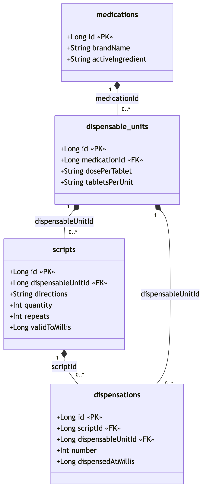
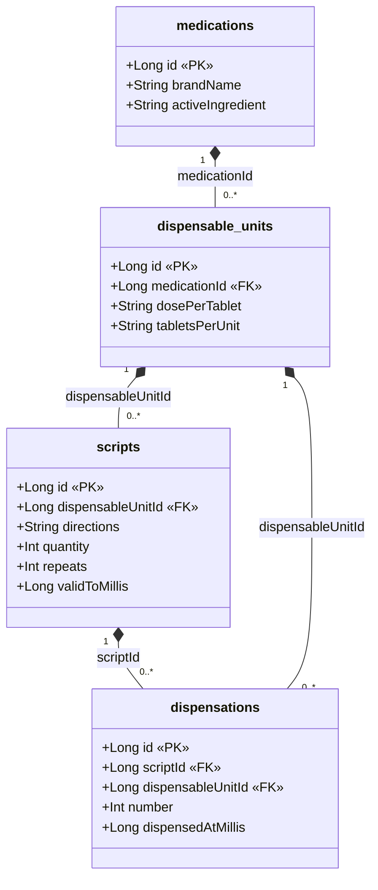

# Database Schema

**Database:** `aitoui.db` (Room) · **version:** 11 · **package:** `com.example.aitoui.data`

The schema models prescriptions and pharmacy dispensing as a chain:

```
medications → dispensable_units → scripts → dispensations
```

A **medication** (brand + active ingredient) comes in one or more **dispensable units** (a format —
a dosage/packaging). A doctor writes a **script** for a single dispensable unit (a unit can appear on
many scripts — **many-to-one**). Each pharmacy fill is recorded as a **dispensation** against a script
and a dispensable unit.

---

## Tables

### `medications`
A medication, identified by its brand name and active ingredient.

| Column | Type | Constraints | Notes |
|---|---|---|---|
| `id` | INTEGER | PK, auto-generated | |
| `brandName` | TEXT | not null | |
| `activeIngredient` | TEXT | not null | |

### `dispensable_units`
A specific format (dosage/packaging) of a medication — a dispensable unit.

| Column | Type | Constraints | Notes |
|---|---|---|---|
| `id` | INTEGER | PK, auto-generated | |
| `medicationId` | INTEGER | **FK → `medications.id`** (ON DELETE CASCADE), indexed | |
| `dosePerTablet` | TEXT | not null | raw text (e.g. `"500"`) |
| `tabletsPerUnit` | TEXT | not null | raw text |

### `scripts`
A prescription — what a doctor writes and you take to the pharmacy. Each script is for one dispensable
unit (many scripts → one unit).

| Column | Type | Constraints | Notes |
|---|---|---|---|
| `id` | INTEGER | PK, auto-generated | |
| `dispensableUnitId` | INTEGER | **FK → `dispensable_units.id`** (ON DELETE CASCADE), indexed | the unit the script is for |
| `directions` | TEXT | not null | how to take it |
| `quantity` | INTEGER | not null | total dispensations allowed |
| `repeats` | INTEGER | not null | |
| `validToMillis` | INTEGER | not null | "valid to" date, epoch millis |

A script's "dispensed" count is **not stored** — it is derived on read by summing `number` over the
script's rows in `dispensations`.

### `dispensations`
A recorded pharmacy fill: a dispensable unit dispensed `number` times against a script. The sum of a
script's `number` values is its derived "dispensed" total (shown as "dispensed/quantity").

| Column | Type | Constraints | Notes |
|---|---|---|---|
| `id` | INTEGER | PK, auto-generated | |
| `scriptId` | INTEGER | **FK → `scripts.id`** (ON DELETE CASCADE), indexed | the script being filled |
| `dispensableUnitId` | INTEGER | **FK → `dispensable_units.id`** (ON DELETE CASCADE), indexed | the unit dispensed |
| `number` | INTEGER | not null | times dispensed (usually 1) |
| `dispensedAtMillis` | INTEGER | not null | recorded at save time, epoch millis |

---

## Relationships

- `medications` **1 — N** `dispensable_units` (`dispensable_units.medicationId`)
- `dispensable_units` **1 — N** `scripts` (`scripts.dispensableUnitId`) — many scripts per unit
- `scripts` **1 — N** `dispensations` (`dispensations.scriptId`)
- `dispensable_units` **1 — N** `dispensations` (`dispensations.dispensableUnitId`)

All foreign keys use `ON DELETE CASCADE`.

---

## UML class diagram

Each table is shown as a class (with Kotlin attribute types). The `ON DELETE CASCADE` foreign keys are
modelled as **compositions** (filled diamond on the parent/whole side) with `1` → `0..*` multiplicities;
the association label is the foreign-key column.



<details>
<summary>Mermaid source (edit this, then re-render the PNG)</summary>



</details>

---

## Notes

- Schema changes during development use Room's `fallbackToDestructiveMigration(dropAllTables = true)`
  (see `AitouiApp`), so bumping the `@Database` version recreates and re-seeds the database rather than
  running hand-written migrations.
- In debug builds the database is auto-seeded on first launch with a moderate amount of sample data
  (see `DatabaseSeeder`).
