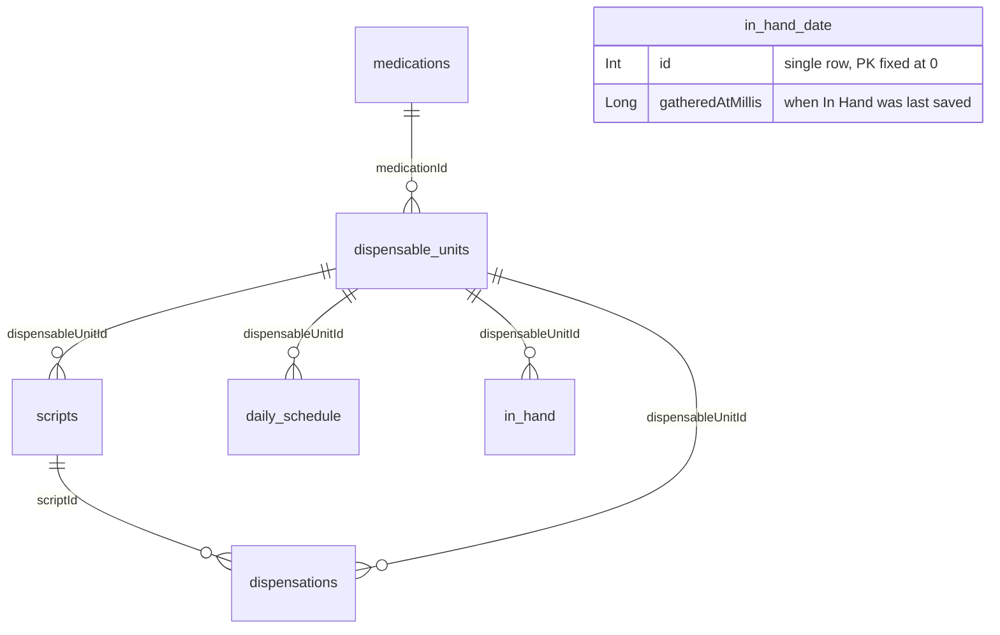
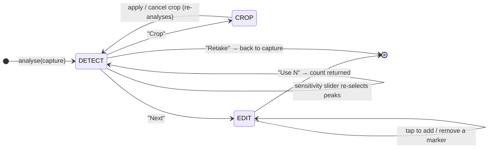
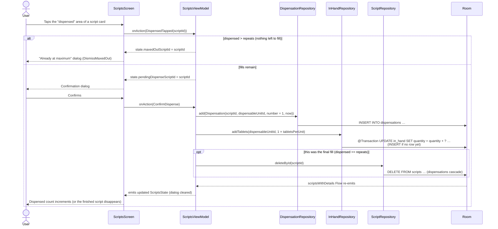
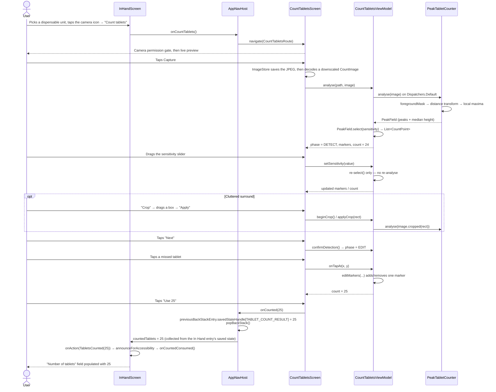

# PxTx — Prescription Tracker

An Android application for managing prescription medications: tracking scripts, recording pharmacy
dispensations, monitoring tablets in hand, and projecting when supplies will run out.

**Package:** `com.example.aitoui`  
**Version:** 1.2.2 (versionCode 5)  
**Min SDK:** 24 (Android 7.0) · **Target SDK:** 36 · **Compile SDK:** 37  
**Database schema version:** 27  
**Toolchain:** Gradle 9.4.1 · AGP 9.2.1 · Kotlin 2.4.0 · Compose BOM 2026.06.00

---

## Table of Contents

1. [What the App Does](#what-the-app-does)
2. [Tech Stack](#tech-stack)
3. [Project Structure](#project-structure)
4. [Architecture Overview](#architecture-overview)
5. [Screen Inventory](#screen-inventory)
6. [Database Schema](#database-schema)
7. [Recurring Patterns & Idioms](#recurring-patterns--idioms)
8. [Interaction Diagrams](#interaction-diagrams)
9. [Testing](#testing)
10. [Building & Running](#building--running)
11. [Related Docs](#related-docs)

---

## What the App Does

PxTx models the lifecycle of a prescription medication from the doctor's surgery to the last tablet:

```
Doctor issues script
  → User scans or manually records the script (serial numbers, dose, repeats, valid-to date)
  → Pharmacist fills a repeat → user records a dispensation
  → User counts tablets in hand (manually or via camera)
  → App projects how long the supply will last against a daily schedule
  → Attention messages warn when a refill or new prescription is needed
```

### Key features

| Feature | Description |
|---|---|
| **Medication catalogue** | Brand name + active ingredient records; flags for over-the-counter vs. prescription |
| **Dispensable units** | Per-format records (dose / dose unit / tablets-per-pack / tablet photo) under each medication |
| **Scripts** | Prescription records with serial numbers, repeats, valid-to date, and dispensation history |
| **Script scanning** | Camera + ML Kit OCR reads a PBS PB038 (yellow repeat-authorisation) form to pre-fill the Add Script screen |
| **Dispensations** | Each pharmacy fill is recorded against a script; the remaining fill count is derived |
| **Daily schedule** | How many tablets of each dispensable unit to take per day (supports fractional quantities) |
| **In Hand** | Tablet counts per dispensable unit; updated manually, or via either camera counter (a menu on the field's camera icon) |
| **Camera tablet counter** | CameraX still + classical CV (distance-transform peaks) → auto-count, live sensitivity slider, optional crop, tap-to-correct |
| **Blister pack counter** | Camera + PCA geometry: auto-frame the packs, adjust the frames by hand, set the pocket grid, tap empty pockets to pop them |
| **Inventory** | Derived supply view per dispensable unit: in-hand days, script days, projected run-out date |
| **Run-out graph** | Visual projection of supply over time |
| **Attention messages** | Main-screen panel — "no scripts left", "running low (scripts still available)", "running low, need a new script", "restock from the chemist" (OTC) |
| **Backup / Restore** | Save/Load a `pxtx-<ddMMyyyy>-db<schema>.zip` (database + tablet photos) to/from Downloads |

---

## Tech Stack

| Layer | Library / Tool |
|---|---|
| Language | Kotlin |
| UI | Jetpack Compose + Material 3 |
| Navigation | `androidx.navigation.compose` with type-safe `@Serializable` routes |
| Database | Room (KSP), hand-written migrations |
| Async | Kotlin Coroutines + `StateFlow` |
| Camera | CameraX (preview, `ImageCapture`) |
| OCR / barcode | ML Kit Text Recognition + Barcode Scanning |
| Image loading | Coil (`coil-compose`) |
| Serialization | `kotlinx.serialization.json` (navigation args + backup manifest) |
| DI | No framework — manual wiring via `Application` class + `APPLICATION_KEY` factory pattern |
| Build | Gradle (Kotlin DSL), version catalog (`gradle/libs.versions.toml`), KSP |
| Unit tests | JUnit 5 (Jupiter) + Vintage engine, Turbine, AssertK, Mockito, `kotlinx-coroutines-test` |
| UI tests | Compose `ui-test-junit4` + Espresso, driven through per-screen Robot classes |
| Coverage | JaCoCo (`./gradlew jacocoTestReport`) |

---

## Project Structure

The project is a **single `:app` module**. Production source lives under
`app/src/main/java/com/example/aitoui/`; `app/src/test/…` (JVM unit tests) and
`app/src/androidTest/…` (Compose UI tests) mirror the same package layout — see [Testing](#testing).

```
com.example.aitoui/
├── AitouiApp.kt              Application — owns the singleton data layer
├── MainActivity.kt           Single activity; hosts the NavHost
├── MainScreen.kt             Main menu (2 × 4 grid) + attention messages + backup dialogs
├── MainViewModel.kt          Backup logic, attention-message derivation
│
├── alerts/                   Supply-warning rule engine
│   └── AttentionMessages.kt  attentionMessages() + medicationSupplies()
│
├── backup/                   Save / Restore to Downloads as pxtx-<date>-db<schema>.zip
│   ├── BackupManager.kt      Zip write / peek / restore (WAL-checkpoint aware)
│   ├── BackupFileName.kt     Default name generation + validation
│   ├── BackupManifest.kt     @Serializable { schemaVersion, createdAtMillis }
│   └── DownloadsBackupStore.kt  MediaStore / legacy-permission abstraction
│
├── counting/                 On-device CV counting engine (pure Kotlin, no Android types, JVM-testable)
│   ├── TabletCounter.kt      CountImage / CountPoint / ReferenceImage + the
│   │                         TabletCounter interface: count(image, reference?) → List<CountPoint>
│   ├── PeakTabletCounter.kt  The counter in use: distance-transform peaks (a light watershed, so
│   │                         touching tablets separate). Split into analyse() → PeakField and
│   │                         PeakField.select(sensitivity) so the slider re-counts cheaply
│   ├── BlobTabletCounter.kt  Simpler reference implementation: Otsu → connected components →
│   │                         centroids. Superseded by PeakTabletCounter; kept for comparison
│   ├── Segmentation.kt       toGrayscale, otsuThreshold, foregroundMask
│   ├── PackSegmentation.kt   PCA-based blister-pack segmentation → PackRegion list
│   ├── PackGrid.kt           Grid math over PackRegion (cellCenter, tapToCell, GridAdjust nudging)
│   ├── MarkerEditing.kt      editMarkers() — tap-to-add / tap-to-remove marker hit-testing
│   ├── FrameBox.kt           Hand-editable oriented rectangle framing one pack (drag / resize /
│   │                         rotate hit-testing); converts to and from PackRegion
│   └── TabletCrop.kt         PixelRect + CountImage.cropped() — restrict detection to a framed region
│
├── dailyschedule/
│   ├── DailyScheduleScreen.kt
│   └── DailyScheduleViewModel.kt
│
├── data/                     Data layer — entities, DAOs, repositories, domain models
│   ├── AppDatabase.kt        Room @Database (version = DATABASE_SCHEMA_VERSION)
│   ├── Migrations.kt         ALL_MIGRATIONS (v21 → v27, hand-written)
│   ├── DoseUnit.kt           Enum with storedAbbreviation + string-resource IDs
│   ├── FuzzyMatcher.kt       Medication / dispensable-unit dedup (Levenshtein-based)
│   ├── TextSimilarity.kt     normalize() + ratio() helpers
│   ├── DatabaseSeeder.kt     Debug-only seed on first launch
│   ├── DatabaseDumper.kt     ASCII table dump to logcat
│   ├── SettingsRepository.kt SharedPreferences (warning window days)
│   ├── Medication*.kt        Entity, DAO, Repository, domain model
│   ├── DispensableUnit*.kt   Entity, DAO, Repository, domain model, Details projection
│   ├── Script*.kt            Entity, DAO, Repository, domain model, Details projection
│   ├── Dispensation*.kt      Entity, DAO, Repository, domain model
│   ├── DailySchedule*.kt     Entity, DAO, Repository, domain model, Details projection
│   ├── InHand*.kt            Entity, DAO, Repository, domain model, Details projection
│   └── InHandDate*.kt        Entity, DAO, single-row (id=0) gathered-date table
│
├── dispensableunit/
│   ├── DispensableUnitsScreen.kt  List screen
│   ├── DispensableUnitsViewModel.kt
│   ├── DispensableUnitScreen.kt   Add / Edit screen
│   ├── DispensableUnitViewModel.kt
│   └── DoseUnitFormatting.kt      Compose helpers: DoseUnit.abbreviation(), .displayName()
│
├── image/
│   ├── CameraCaptureScreen.kt  Reusable CameraX preview + capture composable
│   ├── FullImageViewer.kt      Full-screen Coil image viewer
│   └── ImageStore.kt           Internal-storage JPEG management (thumb + full-res)
│
├── inhand/
│   ├── InHandScreen.kt
│   ├── InHandViewModel.kt
│   ├── blister/                Blister-pack counter
│   │   ├── BlisterCountScreen.kt
│   │   ├── BlisterCountViewModel.kt
│   │   └── PopFeedback.kt      SoundPool pop + haptic
│   └── count/                  Loose-tablet camera counter
│       ├── CountTabletsScreen.kt
│       └── CountTabletsViewModel.kt
│
├── inventory/
│   ├── InventoryScreen.kt
│   ├── InventorySupply.kt      computeSupply() — derives days-of-supply per dispensable unit
│   └── InventoryViewModel.kt
│
├── medication/
│   ├── MedicationsScreen.kt    List screen
│   ├── MedicationsViewModel.kt
│   ├── MedicationScreen.kt     Add / Edit screen
│   └── MedicationViewModel.kt
│
├── navigation/
│   ├── Routes.kt               All @Serializable route objects / data classes
│   └── AppNavHost.kt           NavHost wiring; all cross-screen callbacks
│
├── runout/
│   ├── RunOutGraph.kt          Pure graph model
│   ├── RunOutGraphScreen.kt
│   └── RunOutGraphViewModel.kt
│
├── scan/
│   ├── ScanScriptScreen.kt     Camera + ML Kit OCR / barcode pipeline
│   ├── ScanScriptViewModel.kt
│   ├── PbsScriptParser.kt      Label-anchored PB038 text extraction (pure, JVM-testable)
│   └── OcrModels.kt            OcrLine, ParsedScript data classes
│
├── script/
│   ├── ScriptsScreen.kt        List screen + record-dispensation action
│   ├── ScriptsViewModel.kt
│   ├── AddScriptScreen.kt      Add / Edit screen (manual or pre-filled from scan)
│   ├── AddScriptViewModel.kt
│   └── ResolutionPrompts.kt    Medication / dispensable-unit resolution dialog text
│
├── settings/
│   ├── SettingsScreen.kt
│   └── SettingsViewModel.kt
│
└── ui/                         Shared UI components
    ├── AppTextField.kt         App-wide OutlinedTextField wrapper: FieldRequirement
    │                           (Required by default), "(optional)" labelling, error semantics
    ├── Heading.kt              heading() Modifier — semantic heading for accessibility
    ├── NumericInputSanitizer.kt  digitsOnly() and decimalInput() String extensions
    ├── SelectableRow.kt        Tappable list row with leading radio/checkbox
    ├── UnsavedChangesGuard.kt  AlertDialog — Save / Discard / Cancel on back navigation
    └── theme/                  Color, Shape, Type, Theme composables
```

---

## Architecture Overview

### Layers

```
┌─────────────────────────────────────────────────────────┐
│  Presentation (MVI)                                     │
│  ViewModel  ←→  State (StateFlow) / Action (sealed)     │
│  Screen composable (Root + Content split)               │
├─────────────────────────────────────────────────────────┤
│  Data layer                                             │
│  Repository  ←→  DAO  ←→  Room entity                   │
│  SettingsRepository  ←→  SharedPreferences              │
├─────────────────────────────────────────────────────────┤
│  Application (AitouiApp)                                │
│  Singleton owner: AppDatabase + all Repositories        │
└─────────────────────────────────────────────────────────┘
```

### Dependency injection

There is **no DI framework** (no Koin, no Hilt). `AitouiApp` constructs and holds the singleton
`AppDatabase` and all repositories as `lazy` properties — effectively acting as the DI container
itself. ViewModels obtain their dependencies via the `APPLICATION_KEY` factory pattern:

```kotlin
companion object {
    val Factory = viewModelFactory {
        initializer {
            val app = this[APPLICATION_KEY] as AitouiApp
            MyViewModel(app.myRepository)
        }
    }
}
```

This gives the three things a DI framework is actually solving:

| DI concern | How this app handles it |
|---|---|
| Single instance of expensive objects (DB, repos) | `lazy` properties on `AitouiApp` |
| Inject only what each consumer needs | Constructor parameters declared on each ViewModel |
| Testability — swap real for fake | Pass fakes directly in the ViewModel constructor |

**Why no framework at this size?** The dependency graph is shallow (ViewModel → Repository → DAO,
three levels), there is only one Gradle module so `AitouiApp` is always in scope, there are no
feature-scoped singletons, and the total factory boilerplate (~50–60 lines across ~15 ViewModels)
is no more than the equivalent Koin module definitions would be.

**When this would change:** Adding a second Gradle module, introducing a "user session" scope, or
accumulating enough transitive dependencies that factory constructors become hard to maintain would
all be natural triggers for introducing Koin (or Hilt). Migrating at that point is
straightforward — each `viewModelFactory { initializer { … } }` block maps directly to a Koin
`viewModel { … }` definition.

### Navigation

All routes are `@Serializable` Kotlin objects / data classes in `Routes.kt`. `AppNavHost.kt` wires
them together, forwarding cross-screen callbacks (e.g. `onScanned`, `onCounted`) as lambda
parameters. The back-stack result pattern (`SavedStateHandle`) returns a camera count back to In Hand —
and it lives entirely in `AppNavHost`, so neither ViewModel touches navigation:

```kotlin
const val TABLET_COUNT_RESULT = "tabletCount"

// In AppNavHost, the counter screens report their result upwards:
composable<CountTabletsRoute> {
    CountTabletsRoot(onCounted = { count ->
        navController.previousBackStackEntry?.savedStateHandle?.set(TABLET_COUNT_RESULT, count)
        navController.popBackStack()
    }, onBack = { navController.popBackStack() })
}

// …and the In Hand entry observes its own saved state, passing the value down as a parameter:
composable<InHandRoute> { entry ->
    val countedTablets by entry.savedStateHandle
        .getStateFlow<Int?>(TABLET_COUNT_RESULT, null)
        .collectAsStateWithLifecycle()
    InHandRoot(
        countedTablets = countedTablets,
        onCountedConsumed = { entry.savedStateHandle[TABLET_COUNT_RESULT] = null },
        …
    )
}
```

`InHandRoot` applies it in a `LaunchedEffect(countedTablets)`, announces it for accessibility, then
calls `onCountedConsumed()` so the value can't be re-applied on the next recomposition.

### Reactive data flow

Repositories expose `Flow<List<T>>` / `StateFlow` properties (Room DAOs return `Flow`). ViewModels
`combine` multiple flows and push a single immutable `State` object out via `MutableStateFlow`. The
Compose screen observes it with `collectAsStateWithLifecycle()`.

---

## Screen Inventory

| Screen | Route | Description |
|---|---|---|
| Main menu | `MainRoute` | 2 × 4 grid; attention messages; backup Save/Load |
| Medications list | `MedicationsRoute` | All medications with active ingredient |
| Add/Edit medication | `MedicationRoute` | Brand name, active ingredient, Rx flag |
| Dispensable units list | `DispensableUnitsRoute` | All units, formatted `<dose><unit> × Qty <n>` (e.g. `50mg × Qty 60`) |
| Add/Edit dispensable unit | `DispensableUnitRoute` | Dose, dose unit, qty, tablet photo; fuzzy-dedup on save |
| Scripts list | `ScriptsRoute` | All scripts with fill progress; tap the "dispensed" area to record a fill (confirmed by dialog), delete a script, sort by issue date / brand name |
| Add/Edit script | `ScriptRoute(…args)` | Full script form; fuzzy medication/unit resolution on save |
| Scan script (OCR) | `ScanScriptRoute` | Live CameraX preview → freeze → OCR → pre-fill ScriptRoute |
| Daily schedule | `DailyScheduleRoute` | Per-dispensable-unit daily quantities; replace-all on save |
| In Hand | `InHandRoute` | Per-dispensable-unit counts; the camera icon opens a menu offering either counter |
| Count tablets | `CountTabletsRoute` | CameraX capture → detect (sensitivity slider, optional crop) → edit (tap to correct) → return int |
| Blister count | `BlisterCountRoute` | Capture → frame packs → set pocket grid → pop empties per pack → summary → return int |
| Inventory | `InventoryRoute` | Supply card per dispensable unit; sortable by name / time left |
| Run-out graph | `RunOutGraphRoute` | Visual supply projection over time |
| Settings | `SettingsRoute` | Warning-window days, app/DB version info |

---

## Database Schema

> Full schema detail: [`docs/DATABASE_SCHEMA.md`](docs/DATABASE_SCHEMA.md)  
> UML class diagram (all columns): [`docs/database-schema.png`](docs/database-schema.png)

The domain model forms a chain:



All foreign keys use `ON DELETE CASCADE`; `in_hand_date` stands alone. A script's "times filled" count
is **derived** by summing `dispensations.number` — it is never stored on the script itself.

### Schema version history (hand-written migrations)

| Migration | Change |
|---|---|
| 21 → 22 | Added `scripts.instructions` |
| 22 → 23 | Internal restructure |
| 23 → 24 | Added `medications.requiresPrescription` |
| 24 → 25 | Re-keyed `in_hand` from `medicationId` to `dispensableUnitId` |
| 25 → 26 | Re-keyed `daily_schedule` from `medicationId` to `dispensableUnitId` |
| 26 → 27 | Added `dispensable_units.doseUnit` (TEXT, DEFAULT 'mg') |

`fallbackToDestructiveMigration(dropAllTables = true)` acts as a crash-prevention safety net only
for version jumps not covered by any migration; in normal use it is never triggered.

---

## Recurring Patterns & Idioms

### 1. MVI presentation layer

Every feature follows the same skeleton:

```kotlin
// Immutable state snapshot — the only thing the composable reads
data class FooState(
    val items: List<FooItem> = emptyList(),
    val isLoading: Boolean = false,
)

// All user intents as a sealed hierarchy — the only thing the composable writes
sealed interface FooAction {
    data class ItemSelected(val id: Long) : FooAction
    data object SaveTapped : FooAction
}

class FooViewModel(private val repo: FooRepository) : ViewModel() {
    private val _state = MutableStateFlow(FooState())
    val state: StateFlow<FooState> = _state.asStateFlow()

    fun onAction(action: FooAction) { /* when (action) { … } */ }
}
```

The screen is split into two composables:
- **Root** (named `FooRoot`) — collects state with `collectAsStateWithLifecycle()`, obtains the
  ViewModel via `viewModel(factory = FooViewModel.Factory)`, and wires `onAction`.
- **Content** (named `FooScreen`) — stateless; takes `state` and `onAction` as parameters; has an
  `@Preview`.

### 2. ViewModel factory via `APPLICATION_KEY`

No Koin, no Hilt. Each ViewModel has a `companion object { val Factory = viewModelFactory { … } }`
that casts `this[APPLICATION_KEY]` to `AitouiApp` and extracts the required repositories.

### 3. Type-safe navigation routes

All routes are `@Serializable` Kotlin objects or data classes:

```kotlin
@Serializable
object InventoryRoute          // no arguments

@Serializable
data class ScriptRoute(        // optional pre-filled arguments
    val brandName: String? = null,
    val serialNo: String? = null,
    // …
)
```

Navigation from a screen is passed as a plain lambda (`onNavigateToInventory: () -> Unit`), so
composables never depend on `NavController` directly.

### 4. Unsaved-changes guard

Any add/edit screen that can be navigated away from intercepts both the top-bar back arrow and the
Android system back with a `BackHandler`. When unsaved changes exist, `UnsavedChangesDialog` is
shown offering **Save / Discard / Cancel**. If the form is incomplete (cannot save), only **Discard /
Cancel** are offered.

### 5. Numeric input sanitizers

`NumericInputSanitizer.kt` provides two `String` extension functions used on `onValueChange`:

```kotlin
// Integer-only fields (tablets per pack, repeats, …)
internal fun String.digitsOnly(): String = filter { it.isDigit() }

// Decimal fields (dose per tablet: e.g. 0.5 mg)
internal fun String.decimalInput(): String { /* normalises comma→dot, single separator, leads with 0 */ }
```

### 6. `DoseUnit` enum with constructor properties

The dose unit is stored in the database as a short ASCII token (`"mg"`, `"g"`, `"IU"`, …). The enum
carries both the token and the string resource IDs, eliminating `when` mappings:

```kotlin
enum class DoseUnit(
    val storedAbbreviation: String,        // stored in DB; used for comparisons
    @StringRes val abbreviationResId: Int, // for Compose UI
    @StringRes val displayNameResId: Int,
) {
    MILLIGRAMS("mg", R.string.dose_unit_milligrams_abbreviation, R.string.dose_unit_milligrams_display_name),
    // …
}

// Look up from DB string:
fun doseUnitFromAbbreviation(abbr: String): DoseUnit? =
    DoseUnit.entries.firstOrNull { it.storedAbbreviation == abbr }
```

### 7. Fuzzy medication / dispensable-unit deduplication

`FuzzyMatcher` (backed by `TextSimilarity.ratio()` — a Levenshtein-based similarity score)
classifies entered values against existing records when the user saves a new script:

- **Exact** match → offer the existing record for selection (skip creation).
- **Similar** (`SIMILAR = 0.45` on any one of the four field comparisons) → offer as a candidate. The
  threshold is deliberately low: the resolve dialog always confirms the pick, so a spare candidate
  costs a glance whereas a missed one costs a duplicate record.
- **Blocked** (`BLOCK = 0.90` on brand *and* active ingredient) → refuse creation of a near-duplicate.

Both the match and the block are computed in *either* orientation — entered brand vs. brand and active
vs. active, or brand vs. active and active vs. brand — so a medication entered with the two fields
transposed still resolves to (and is blocked by) the existing record.

For dispensable units there is no fuzzy scoring: all of the resolved medication's units are offered as
candidates, and creation is blocked only when dose, tablets-per-unit **and** dose unit all match
(after normalisation), so `50 mg × 60` and `50 IU × 60` are correctly treated as different formats.

### 8. Camera counter phase machine

Both `CountTabletsViewModel` and `BlisterCountViewModel` drive their UI from an explicit phase enum
(`CountPhase` / `BlisterPhase`). Camera permission is *not* a phase — each camera screen gates itself
on `Manifest.permission.CAMERA` in the composable (`PermissionGate` / `CameraCaptureScreen`) before any
phase is entered.

Loose tablets — `CountPhase`:



Blister packs — `BlisterPhase`:

```mermaid
stateDiagram-v2
    direction LR
    [*] --> CAPTURE
    CAPTURE --> FRAME: segmentPacks() seeds one FrameBox per pack
    FRAME --> FRAME: drag / resize / rotate / add / delete frames
    FRAME --> FORMAT: confirmFrames()
    FORMAT --> FORMAT: set rows × columns
    FORMAT --> POP: confirmFormat()
    POP --> POP: tap empty pockets; nudge / stretch the grid; nextPack()
    POP --> SUMMARY: after the last pack
    SUMMARY --> [*]: total returned
```



Both ViewModels hold the captured image path (not the composable), so the frozen frame survives
rotation, and both delete that temp capture in `onCleared()`. Note these two deviate from the
`onAction(Action)` MVI convention used elsewhere: they expose named methods (`analyse`,
`setSensitivity`, `applyCrop`, `confirmFrames`, `popAt`, `stepBack`, …) because the camera screens
call them from gesture and lifecycle callbacks rather than from a single event sink.

### 9. Backup / Restore

A backup is a ZIP file — named `pxtx-<ddMMyyyy>-db<schema>.zip` by default (e.g.
`pxtx-30072026-db27.zip`, see `BackupFileName.default()`), editable by the user in the Save dialog —
containing:

```
manifest.json              { "schemaVersion": 27, "createdAtMillis": … }
database/aitoui.db
images/unit_images/        thumbnail JPEGs
images/unit_images_full/   full-res JPEGs
```

Before writing, `AitouiApp.checkpointDatabase()` merges the WAL into the main file so the copy is
complete. Before restoring, `AitouiApp.closeDatabase()` releases Room's handle; the app process is
then restarted via `Intent.FLAG_ACTIVITY_NEW_TASK or FLAG_ACTIVITY_CLEAR_TASK` + `Runtime.exit(0)`.

### 10. OCR script parsing (`PbsScriptParser`)

The parser is label-anchored: it finds known printed labels on a PB038 form (e.g. "valid to",
"repeats", "eRx:") and reads the adjacent value. It is pure Kotlin, JVM-testable (takes a
`List<OcrLine>`), and deliberately best-effort — the Add Script review screen is the safety net.
O/0 confusion (common with digit OCR) is repaired with `normaliseDigits()`. If OCR misses the second
serial number, `PbsScriptParser.erxFromBarcodes()` recovers the eRx token from the form's Code 128 /
QR barcodes via ML Kit barcode scanning.

### 11. Required-by-default form fields (`AppTextField`)

Every form field goes through `AppTextField`, which carries the app's requirement convention: fields
are **required by default** and only the minority are marked, by appending "(optional)" to the visible
label text (not an asterisk or a colour, so TalkBack reads it for free and WCAG 1.4.1 / 3.3.2 hold).
Each form states the convention once via `requiredFieldsNote()` in its intro text.

```kotlin
enum class FieldRequirement { Required, Optional }

AppTextField(
    value = state.serialNo2,
    onValueChange = { onAction(AddScriptAction.SerialNo2Changed(it)) },
    label = stringResource(R.string.add_script_erx_token_label),
    requirement = FieldRequirement.Optional,   // one of the few exceptions, so it is marked
)
```

Requirement is only *communicated* here. It is *enforced* by each screen's `state.canSave`, which
disables Save until the required fields are filled; `AppTextField` also accepts an `errorText` that
flips the field to its error style and sets the error semantics for TalkBack when a screen wants to
call out an invalid field inline.

---

## Interaction Diagrams

### Use case 1 — Recording a dispensation from the Scripts screen

The user taps the "dispensed" area of a script card and confirms a pharmacy fill. The dispensation is
persisted and the in-hand quantity for that dispensable unit is incremented in one transaction. A
script allows `repeats + 1` fills, so on the final fill the script's lifecycle is over and the script
row is deleted (its dispensations cascade). The list then refreshes reactively from Room.



---

### Use case 2 — Camera tablet count feeding the In Hand screen

The user photographs loose tablets; the app auto-counts them, lets the user tune the sensitivity and
correct individual markers, then returns the integer to the In Hand screen via the back-stack result.



---

## Testing

Test sources mirror the production package layout, so a class's tests sit in the same package as the
class itself.

| Source set | What lives there | Stack |
|---|---|---|
| `app/src/test/…` | JVM unit tests: every ViewModel, the pure counting/CV engine, `PbsScriptParser`, `FuzzyMatcher`, `InventorySupply`, `AttentionMessages`, `RunOutGraph`, `BackupFileName`, the numeric sanitizers, state-derivation (`*StateTest`) | JUnit 5 (Jupiter), Turbine, AssertK, Mockito, `UnconfinedTestDispatcher` |
| `app/src/androidTest/…` | Compose UI tests, one `*ScreenTest` + `*Robot` pair per screen | `createAndroidComposeRule<ComponentActivity>`, `ui-test-junit4`, Espresso |

### Running

```zsh
# JVM unit tests (Gradle is configured with useJUnitPlatform())
./gradlew testDebugUnitTest

# …plus a JaCoCo coverage report → app/build/reports/jacoco/jacocoTestReport/html/index.html
./gradlew jacocoTestReport

# Compose UI tests — needs a connected device or running emulator
./gradlew connectedDebugAndroidTest
```

HTML results land in `app/build/reports/tests/testDebugUnitTest/index.html` (unit) and
`app/build/reports/androidTests/connected/debug/index.html` (instrumented).

### Conventions

- **ViewModel tests** set `Dispatchers.setMain(UnconfinedTestDispatcher())` in `@BeforeEach`, reset it
  in `@AfterEach`, and assert on state with Turbine (`vm.state.test { awaitItem() … }`). Dependencies
  are hand-rolled fakes implementing the DAO/repository interface, or Mockito mocks where a single
  interaction is being verified — no DI framework is involved, since ViewModels take constructor
  parameters.
- **UI tests** use the Robot pattern: the robot calls `setContent { … }` on the *stateless* `FooScreen`
  composable with a hand-built `FooState`, exposes `assert*` / `perform*` methods, and looks nodes up
  by string resource or `testTag` — so the tests never depend on a real database or ViewModel.
- JUnit 4 tests still run alongside JUnit 5 via the Vintage engine (`junit-vintage-engine`).

---

## Building & Running

### Prerequisites

- Android Studio recent enough for AGP 9.2 (the project targets Gradle 9.4.1 / AGP 9.2.1 / Kotlin 2.4.0)
- JDK 17+ to run Gradle (AGP 9 requires it); the modules themselves compile at Java/Kotlin language
  level 11 (`sourceCompatibility`/`targetCompatibility = VERSION_11`)
- Android SDK — compile SDK 37, build-tools matching

### Clone and open

```zsh
git clone git@github-rodney:replicant1/aitoui.git
cd aitoui
# Open in Android Studio: File → Open → select the aitoui folder
```

### Build and install (command line)

```zsh
# Debug build
./gradlew installDebug

# Release build (unsigned; minification is off)
./gradlew assembleRelease
```

### Debug seed data

In a debug build, `DatabaseSeeder` auto-populates an empty database on first launch with a moderate
set of sample medications, dispensable units, scripts, dispensations, a daily schedule, and in-hand
quantities — so the app can be exercised immediately without manual data entry.

### Backup file format

Backups are written to the device's Downloads folder, named `pxtx-<ddMMyyyy>-db<schema>.zip` by
default (e.g. `pxtx-30072026-db27.zip`) — the Save dialog lets the user edit the name, and a missing
`.zip` extension is added for them. They can be transferred between devices: on load the app reads the
manifest's schema version first, **rejects** a backup newer than the running app, and otherwise lets
Room migrate an older database on the next open (see `MainViewModel`). Note that
`SharedPreferences` settings (the warning window) are **not** in the backup — only `aitoui.db` and the
tablet photos.

---

## Related Docs

| Document | Description |
|---|---|
| [`docs/DATABASE_SCHEMA.md`](docs/DATABASE_SCHEMA.md) | Full table definitions, column types, constraints, relationships, migration history (current: v27) |
| [`docs/database-schema.png`](docs/database-schema.png) | UML class diagram of the current schema — regenerate with `mmdc` from the Mermaid source in the schema doc after any schema change |
| [`docs/tablet-counting-mvp.md`](docs/tablet-counting-mvp.md) | Original design record for the loose-tablet camera counter: user flow, counting engine interface, wiring into In Hand. Its status banner lists where the shipped code diverged (`CountImage`/`CountPoint`, `PeakTabletCounter`, sensitivity slider, crop phase) |
| [`docs/blister-counting-mvp.md`](docs/blister-counting-mvp.md) | Original design record for the blister-pack camera counter: geometry-only approach, PCA segmentation, pop-the-empties UX. Its status banner notes the shipped phase machine, which adds the hand-adjustable framing step |
| [`docs/ACCESSIBILITY_AUDIT.md`](docs/ACCESSIBILITY_AUDIT.md) | Accessibility review findings and remediation status |
| [`docs/mockups/`](docs/mockups/) | Static HTML mockups used to agree a screen change before implementing it |

