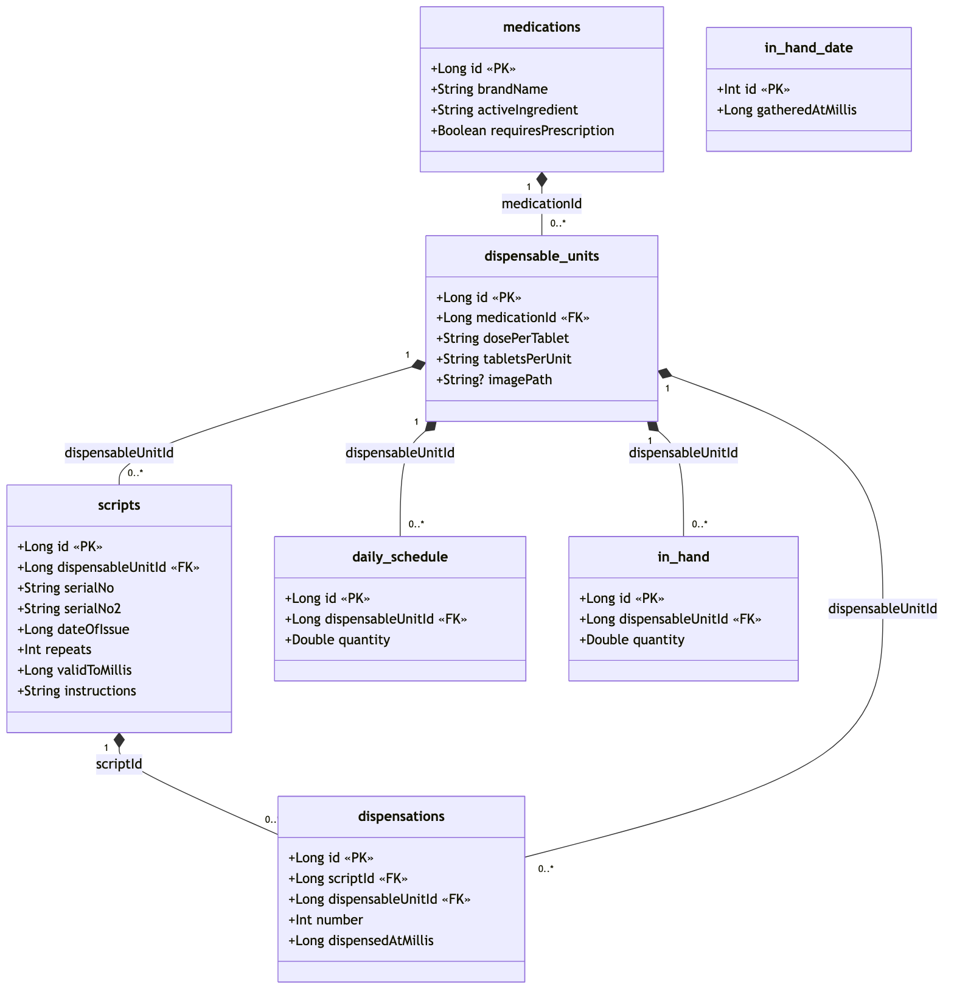
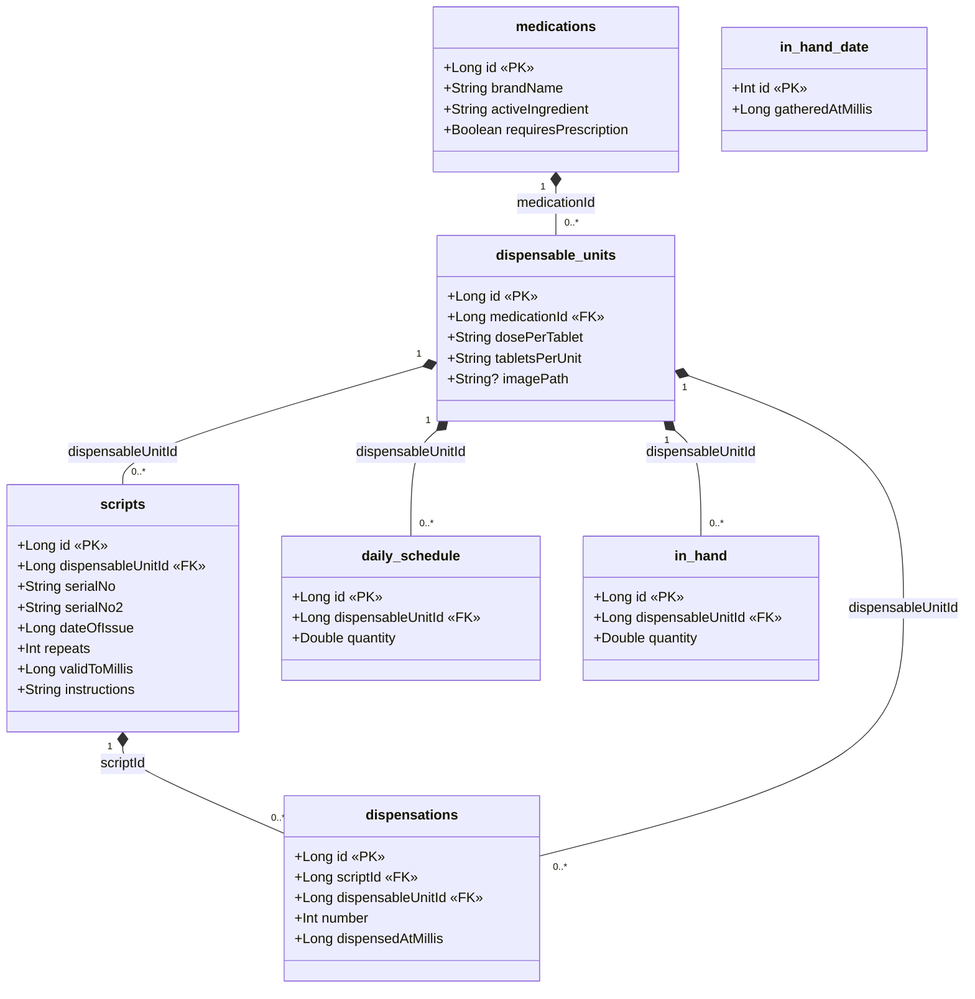

# Database Schema

**Database:** `aitoui.db` (Room) · **version:** 26 · **package:** `com.example.aitoui.data`

The schema models prescriptions and pharmacy dispensing as a chain:

```
medications → dispensable_units → scripts → dispensations
```

A **medication** (brand + active ingredient) comes in one or more **dispensable units** (a format —
a dosage/packaging). A doctor writes a **script** for a single dispensable unit (a unit can appear on
many scripts — **many-to-one**). Each pharmacy fill is recorded as a **dispensation** against a script
and a dispensable unit.

---

## Tables

### `medications`
A medication, identified by its brand name and active ingredient.

| Column | Type | Constraints | Notes |
|---|---|---|---|
| `id` | INTEGER | PK, auto-generated | |
| `brandName` | TEXT | not null | |
| `activeIngredient` | TEXT | not null | |
| `requiresPrescription` | INTEGER | not null, default `1` | boolean (`1` = needs a prescription). Drives the "no scripts"/"get a script" attention messages. Added in `MIGRATION_23_24`. |

### `dispensable_units`
A specific format (dosage/packaging) of a medication — a dispensable unit.

| Column | Type | Constraints | Notes |
|---|---|---|---|
| `id` | INTEGER | PK, auto-generated | |
| `medicationId` | INTEGER | **FK → `medications.id`** (ON DELETE CASCADE), indexed | |
| `dosePerTablet` | TEXT | not null | raw text (e.g. `"500"`) |
| `tabletsPerUnit` | TEXT | not null | raw text |
| `imagePath` | TEXT | nullable | filename of the unit's tablet photo in internal storage (`unit_images/`), or null |

### `scripts`
A prescription — what a doctor writes and you take to the pharmacy. Each script is for one dispensable
unit (many scripts → one unit).

| Column | Type | Constraints | Notes |
|---|---|---|---|
| `id` | INTEGER | PK, auto-generated | |
| `dispensableUnitId` | INTEGER | **FK → `dispensable_units.id`** (ON DELETE CASCADE), indexed | the unit the script is for |
| `serialNo` | TEXT | not null | prescription serial number |
| `serialNo2` | TEXT | not null | second serial number (from the PB038 form); `""` if none |
| `dateOfIssue` | INTEGER | not null | date issued, epoch millis |
| `repeats` | INTEGER | not null | |
| `validToMillis` | INTEGER | not null | "valid to" date, epoch millis |
| `instructions` | TEXT | not null | directions for use (e.g. `"Take ONE tablet TWICE a day"`); `""` if none |

A script's "dispensed" count is **not stored** — it is derived on read by summing `number` over the
script's rows in `dispensations`.

### `dispensations`
A recorded pharmacy fill: a dispensable unit dispensed `number` times against a script. The sum of a
script's `number` values is its derived "dispensed" total.

| Column | Type | Constraints | Notes |
|---|---|---|---|
| `id` | INTEGER | PK, auto-generated | |
| `scriptId` | INTEGER | **FK → `scripts.id`** (ON DELETE CASCADE), indexed | the script being filled |
| `dispensableUnitId` | INTEGER | **FK → `dispensable_units.id`** (ON DELETE CASCADE), indexed | the unit dispensed |
| `number` | INTEGER | not null | times dispensed (usually 1) |
| `dispensedAtMillis` | INTEGER | not null | recorded at save time, epoch millis |

### `daily_schedule`
The daily medication schedule: how many tablets of each dispensable unit are taken every day. Keyed per
dispensable unit (dose/format), not per medication, since `MIGRATION_25_26`. The Daily Schedule screen
replaces the whole table on save.

| Column | Type | Constraints | Notes |
|---|---|---|---|
| `id` | INTEGER | PK, auto-generated | |
| `dispensableUnitId` | INTEGER | **FK → `dispensable_units.id`** (ON DELETE CASCADE), indexed | the unit taken |
| `quantity` | REAL | not null | tablets taken per day (may be fractional, e.g. `0.5`) |

### `in_hand`
Tablets currently in the user's possession — dispensed but not yet consumed. Keyed per dispensable unit
(dose/format), not per medication, since `MIGRATION_24_25`. Recording a dispensation (from the Scripts
screen) adds that many tablets here; the In Hand screen replaces the whole table on save.

| Column | Type | Constraints | Notes |
|---|---|---|---|
| `id` | INTEGER | PK, auto-generated | |
| `dispensableUnitId` | INTEGER | **FK → `dispensable_units.id`** (ON DELETE CASCADE), indexed | the unit in hand |
| `quantity` | REAL | not null | tablets in hand (may be fractional) |

### `in_hand_date`
The date the `in_hand` figures were gathered — when the user last pressed "Save" on the In Hand screen
(UTC epoch millis at the start of that day). A **single-row** table: the primary key is fixed (`id = 0`)
and each save overwrites the one row, so it never grows. Standalone — no foreign key.

| Column | Type | Constraints | Notes |
|---|---|---|---|
| `id` | INTEGER | PK, fixed (`0`) | single-row table; not auto-generated |
| `gatheredAtMillis` | INTEGER | not null | when the figures were gathered, epoch millis (start of day, UTC) |

---

## Relationships

- `medications` **1 — N** `dispensable_units` (`dispensable_units.medicationId`)
- `dispensable_units` **1 — N** `scripts` (`scripts.dispensableUnitId`) — many scripts per unit
- `scripts` **1 — N** `dispensations` (`dispensations.scriptId`)
- `dispensable_units` **1 — N** `dispensations` (`dispensations.dispensableUnitId`)
- `dispensable_units` **1 — N** `daily_schedule` (`daily_schedule.dispensableUnitId`)
- `dispensable_units` **1 — N** `in_hand` (`in_hand.dispensableUnitId`)

`in_hand_date` is standalone (single-row, no foreign key). All foreign keys use `ON DELETE CASCADE`.

---

## UML class diagram

Each table is shown as a class (with Kotlin attribute types). The `ON DELETE CASCADE` foreign keys are
modelled as **compositions** (filled diamond on the parent/whole side) with `1` → `0..*` multiplicities;
the association label is the foreign-key column.



<details>
<summary>Mermaid source (edit this, then re-render the PNG)</summary>



</details>

---

## Notes

- Schema changes are covered by **hand-written migrations** (`Migrations.kt`, spread into
  `addMigrations(*ALL_MIGRATIONS)` in `AitouiApp`), so bumping the `@Database` version preserves existing
  data across the versions they cover. Current history: `21→22` (adds `scripts.instructions`), `22→23`,
  `23→24` (adds `medications.requiresPrescription`), `24→25` (re-keys `in_hand` to `dispensableUnitId`),
  `25→26` (re-keys `daily_schedule` to `dispensableUnitId`). `fallbackToDestructiveMigration(dropAllTables
  = true)` remains only as a safety net for any version jump **not** covered by a migration (it recreates
  and re-seeds instead of crashing).
- In debug builds the database is auto-seeded on first launch with a moderate amount of sample data
  (see `DatabaseSeeder`).
- User **preferences** (e.g. the attention-message "warning window") are **not** in this database — they
  live in `SharedPreferences` (`SettingsRepository`), and are therefore excluded from the Save/Load backup,
  which captures only `aitoui.db` and the unit images (see `BackupManager`).
